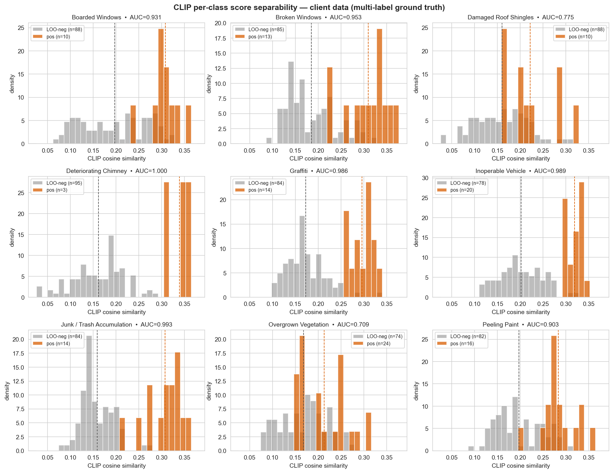
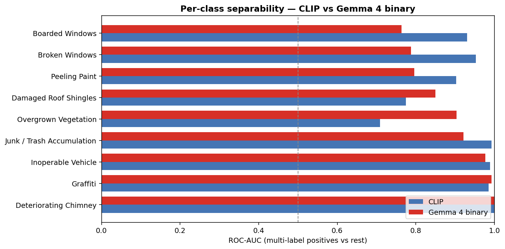

# Phase 2：用 CLIP + Gemma 4 Cascade 替代单模型 Classification

> INST623 AI Adoption Clinic — Final Project
> Chihao Li（Technical Lead）· 2026-04-13

---

## 背景

我们在为 Riverdale Park 市政府做一个代码执法图像分类系统。客户 Ryan Chelton 是 Development Services 的主管，他的痛点很具体：inspector 每天拍大量违规照片，然后要手动查几百条市政代码决定 cite 哪一条。他希望 AI 能看一眼照片就返回匹配的 code（比如 § 304.7 Damaged Roof Shingles），inspector 只需要确认或拒绝。

客户数据本来应该是主角，但今年一直被 compliance 审查卡着没法送出。到上周为止，我们手上只有 98 张真实 inspector 照片，按官方 code 组织成 14 个文件夹，其中 9 个有图，合计 98 张。这个量级对"训练一个 14 类分类器"来说远远不够，所以整个项目的主路线是**零样本** —— 用现成的 foundation model 直接评估客户任务，不微调。

---

## 我们之前做到哪了

上周我们用 CLIP ViT-B/32（LAION-2B）和刚开源的 Gemma 4 E4B-IT（4-bit 量化，通过 mlx-vlm 在 M4 Mac 上本地跑）两个零样本模型跑了客户数据。CLIP 走的是 softmax + argmax + top-3 的 classification 路线；Gemma 4 被 prompt 成 "returns a ranked top-3 JSON" 的 ranked classifier。两个模型在 multi-label 真值下分别是：

| 模型 | Top-1 | Top-3 |
|------|:---:|:---:|
| CLIP ViT-B/32 | 80.6% | 94.9% |
| Gemma 4 E4B-IT | **85.7%** | **96.9%** |

数字还行，但 Phase 1 真正的产出是一个对任务 framing 的质疑 —— 在逐张 debug Gemma 的 31 个错判时，我发现了两件事：

第一，客户数据里有 **11 张物理照片同时出现在多个文件夹下**（md5 验证完全相同）。比如一张废弃烧毁房屋的照片同时被归在 Graffiti、Long Grass 和 Damaged Roof Shingles 三个类别里 —— 客户自己就把它打了三个标签。也就是说**数据结构本质上是 multi-label 的**，我前面按 single-label classification 评估是强行塞进了错的框架。

第二，Gemma 在 `boarded_windows` 这类上 recall 只有 25%，但不是因为看不见 —— 它的 rationale 明确在描述"weathered wood with peeling paint and broken shingles"。问题是 ranked 模式逼它**在 9 个类里挑一个最具体的**，所以它选了更 fine-grained 的 peeling_paint 而不是更泛的 boarded_windows。这是 reasoning 层面的 over-specificity，不是 perception 层面的 miss。

把这两件事合起来，结论很清晰：**classification 本身是错的任务定义**。inspector 的真实问题不是"这张图属于哪一类"（分子是一个类），而是"对每个 code，这张图能不能 cite"（分子是 yes/no × 9 个类）。前者是多选一，后者是 9 个独立判断。

---

## 为了解决什么问题

Phase 1 留下三个"推理说得通"的猜想，需要用实验落到"数字说得通"：

**(1) Per-class binary detection 真的比 multi-class classification 更匹配任务吗**？从 Gemma 的 ranked 模式切成独立的 per-class yes/no query，模型的行为会不会变好？

**(2) CLIP 和 Gemma 在 Phase 1 里表现出明显的互补模式**（CLIP 擅长某些类、Gemma 擅长另一些），能不能拼成一个 cascade 架构 —— CLIP 快速生成候选，Gemma 对每个候选独立判别？这个架构真的比单模型好吗？

**(3) Phase 1 里 `peeling_paint` 和 `overgrown_vegetation` 这两类一直出现奇怪的失败模式**，现有的 multi-label 真值可能本身 under-complete（客户只标了主违规，没标背景违规），这个猜测能不能被数据支持？

Phase 2 的目标就是把这三个猜想跑成数字。

---

## 我们做了什么

整个 Phase 2 只做三件事：

**第一件，CLIP per-class separability 分析。** 之前我们把 CLIP 的输出走 softmax + argmax，丢掉了一大半信息。这次直接保留 98×9 的 raw cosine similarity 矩阵 —— 每一列是"CLIP 对某类的独立打分"，每一行是"一张图对所有类的相对匹配度"。用这个矩阵算 top-k hit-any recall，也就是"对一张图，CLIP 的 top-k 里有没有命中它的任何一个真实标签"。这是 cascade 架构里 Stage 1 的唯一 KPI。

**第二件，Gemma 4 per-class binary verification。** 重新设计 prompt，每次只问一个类："Does this image show {description}?"让模型返回一行 JSON：`{"answer": "yes"/"no", "confidence": 0-100, "rationale": "..."}`。对 98 张图 × 9 个类 = **882 次独立推理**。因为这个 run 要跑 40+ 分钟，我给它加了 **resume 能力** —— 中断后重启会从 JSONL 日志读已完成的 (i, j) 对，直接跳过。事后验证这个 resume 救了一次命：笔记本半夜睡眠后 MPS 降速，我手动重启一次，无损继续。

**第三件，Cascade 拼装。** 把 CLIP 的 raw similarity 和 Gemma 的 binary scores 合并 —— 对每张图，CLIP 出 top-k 候选，Gemma 对这 k 个独立回答 yes/no，阈值以上的进最终输出。评估不同 k（3、5、9）和不同 threshold 下的 Jaccard / sample-F1，和两个单模型 baseline 做对比。

三件事没有引入任何训练、微调、或新数据，用的全是客户手头那 98 张照片和两个现成的 foundation model checkpoint。

---

## 结果

### CLIP Stage 1：top-k hit-any

CLIP 单独看，top-5 的时候已经几乎到顶：

| k | hit-any | 漏掉的图 |
|:---:|:---:|:---:|
| 1 | 80.6% | 19 |
| 3 | 94.9% | 5 |
| 5 | **99.0%** | 1 |
| 6 | 100.0% | 0 |

k=5 是默认推荐 —— 99% 召回，只比 k=9 全跑漏 1 张，Gemma 推理成本节省 44%。

但 per-class 拆开看，有一个非常具体的坏消息：**`damaged_roof_shingles` 从 top-3 到 top-5 再到 top-7 都是 40% 召回**，也就是 10 张真实 roof_shingles 正例里有 6 张 CLIP 完全没把这类排进前 5 名。其余 8 类在 top-5 都是 100%。roof_shingles 是**唯一一个系统性、可复现的 Stage 1 漏洞**。

为什么整体 hit-any@top-5 还是 99%？因为那 6 张漏掉的图本身是多违规的，它们的 multi-label 里还有别的类（peeling_paint、junk_trash）被 CLIP 捞回了 top-5。**整体 hit-any 看不出 per-class 的漏洞，per-class 看得一清二楚**。

下图是 CLIP 对 9 个类的 per-class 分数分布（每张图对某类的 raw cosine similarity），橙色是正例、灰色是其他类的 LOO 负例，AUC 标在每个子图上。7/9 类的分数分布有明显分离，damaged_roof_shingles 和 overgrown_vegetation 明显重叠严重：



### Gemma 4 binary：per-class recall / precision

882 次推理全部返回合法 JSON（parse 100%）。Per-class 在 threshold 0.5 下的数据：

| 类别 | AUC | Recall | Precision |
|------|:---:|:---:|:---:|
| chimney | 1.000 | 1.00 | 0.75 |
| graffiti | 0.993 | 1.00 | 0.67 |
| inoperable_vehicle | 0.977 | 0.90 | 0.72 |
| junk_trash | 0.922 | 1.00 | 0.36 |
| overgrown_vegetation | 0.904 | 1.00 | 0.48 |
| damaged_roof_shingles | 0.850 | 0.70 | 0.50 |
| peeling_paint | 0.796 | 1.00 | 0.27 |
| broken_windows | 0.787 | 0.54 | 0.64 |
| boarded_windows | 0.764 | 0.60 | 0.43 |

两个模式特别明显：

- **Recall 普遍很高**：9 类里 5 类 recall 100%。Binary 模式下 Gemma 比 ranked 模式下"更愿意说 yes"，因为没有 argmax 的互相挤压，每个 yes 不需要压掉其他类。这正好印证了 Phase 1 关于 "boarded_windows 不是看不见" 的猜测。
- **Precision 在 peeling_paint、junk_trash、overgrown、boarded 四类上明显偏低**。最极端的 `peeling_paint` 只有 27% —— 也就是 Gemma 说 yes 的图里有 73% 不在客户的 multi-label 真值里。

这个 precision 分布非常重要，后面会讲为什么它不是模型错了。

### 对比 CLIP 和 Gemma binary 的 per-class AUC

把两个模型的 per-class AUC 并排放，互补性几乎是教科书级的：

| 类别 | CLIP | Gemma binary | 谁强 |
|------|:---:|:---:|---|
| chimney | 1.000 | 1.000 | 平 |
| graffiti | 0.986 | 0.993 | 近平 |
| vehicle | 0.989 | 0.977 | 近平 |
| junk_trash | 0.993 | 0.922 | CLIP |
| **overgrown_vegetation** | 0.709 | **0.904** | **Gemma 大胜** |
| **damaged_roof_shingles** | 0.775 | **0.850** | **Gemma 胜** |
| broken_windows | **0.953** | 0.787 | CLIP 胜 |
| boarded_windows | **0.931** | 0.764 | CLIP 胜 |
| peeling_paint | **0.903** | 0.796 | CLIP 胜 |

**Gemma 救 CLIP 的地方**，恰好是 CLIP 在 Phase 1 里跪得最惨的两类（overgrown、roof）。**CLIP 救 Gemma 的地方**，恰好是三个立面窗户类（broken / boarded / peeling）—— 这些类视觉上很明确但 Gemma 在 9 选 1 时会 over-specify。两个模型的短板几乎不重叠，这是 cascade 能奏效的前提条件。

下图是两个模型的 per-class AUC 并排柱状图。互补形状非常清晰：



### Cascade：两个模型拼起来

Cascade 在不同 k 下（threshold 固定为 0.5）的结果：

| 配置 | Jaccard | Sample-F1 | 每图平均预测数 |
|------|:---:|:---:|:---:|
| Gemma 单独（等价 k=9） | 0.525 | 0.633 | 2.43 |
| Cascade k=5 | 0.568 | 0.668 | 2.08 |
| **Cascade k=3** | **0.622** | **0.703** | 1.60 |

**Cascade k=3 的 F1 是 0.703，比 Gemma binary 单模型的 0.633 高 7 个点**，同时每图平均预测数从 2.43 降到 1.60（少报 34% 的类）。

这里有一个非常反直觉的现象：**k 越小，F1 越高**。k=3 的 F1 (0.703) > k=5 (0.668) > k=9 (0.633)。常识应该是 "给 Gemma 更多候选 = 更全的 recall = 更高 F1"，但数据是反过来的。下面会讲为什么。

---

## 结论

**第一个结论：Reframe 到 per-class binary 是对的**。

这个结论从三个独立证据得到验证：

1. Gemma 在 binary 模式下，boarded_windows recall 从 ranked 模式的 25% 爬回到 60%（同一个模型、同一张图、同一个 checkpoint，只是 prompt 从 "pick top-3" 换成 "yes/no for X"）
2. 几个之前在 ranked 模式下被 argmax 压低的类（graffiti、chimney、peeling_paint）在 binary 模式下 recall 全部到 100%
3. CLIP 的 per-class AUC 分析也确认了同样的现象：很多类的 separability 远高于它们在 top-k 竞争里的表现，说明 multi-class argmax 在浪费 CLIP 本来就有的信息

这验证了 Phase 1 的核心论点 —— **问题不在模型能力，问题在任务定义**。同一个模型，换了询问方式就能表现得更好，这是任务定义错了的实锤。

**第二个结论：Cascade 不是一个"省钱的 filter + verifier" pipeline，而是一个"两阶段独立证据 joint verification" 架构**。

这个结论来自 "k 越小 F1 越高" 的反直觉发现。我原本的 mental model 是 "CLIP 是便宜的过滤器，Gemma 是昂贵的 verifier"，按这个 model，k 越大应该 recall 越高、F1 越高。但数据否决了这个 mental model。

正确的 mental model 是：**CLIP 和 Gemma 各是一个独立的证据来源，cascade 的本质是要求两个来源都同意**。对 `peeling_paint` 这种 Gemma 高 FPR 的类，CLIP 的"沉默"（把它排在 top-k 之外）就是一个否决权，直接阻止 Gemma 触发它自己的 false positive。k=3 比 k=5 好，正是因为 k=3 的 CLIP filter 更严格，两阶段 AND 的精度保护更强。

这个发现把 cascade 从"效率优化"升级成"精度提升机制"，给团队对 Ryan 解释的话术完全变了 —— 不是"AI 系统靠 CLIP 筛候选再让 Gemma 最终判断"，而是"两个独立的 foundation model 必须同时认可一个 flag 才会推荐"。后者更接近 responsible AI 的叙事。

**第三个结论：剩下的 precision 问题不全是模型错，很可能是 ground truth 错**。

`peeling_paint` 在 cascade k=3 下 recall 100% 但 precision 只有 40%，`overgrown_vegetation` 是 recall 88% / precision 58%。表面看是两个模型在"误报"，但两件事指向 truth-side 的问题：

1. 这两类恰好是**视觉上无处不在**的违规 —— Riverdale 的破败房屋几乎每张都有些油漆剥落，每个院子多少都有草
2. 客户的归档逻辑是 "inspector 这次 cite 了哪一条"，不是 "这张图里有哪些能 cite"。所以一张图如果 inspector 选择 cite 了 boarded_windows，它的 peeling_paint 标签就被省略了，哪怕墙上的油漆确实在剥落

也就是说，Gemma 在 peeling_paint 上的那些 "false positive" 很可能是在指认**客户没标但其实存在的真违规**。要最终确认这个猜测，需要 (a) 对现有 98 张照片做 full multi-label 重新标注，或 (b) 加入真正的 "no violation" 负例作为对照。

---

## 启示

**任务 framing 的 ROI 远远高于模型调参**。

Phase 1 + Phase 2 两轮，真正带来提升的每一步都是 framing 调整：
- 上周报告里从 multi-class → multi-label 评估，直接让 Gemma 数字从 68% 涨到 86%
- 本周从 ranked → binary，再从 binary → cascade，F1 从 0.633 涨到 0.703

没有任何一次涨点来自训练、微调、换更大模型、调 hyperparameter。全部来自"我问模型的问题是否是我真正想问的问题"这一层的反思。对 AI 应用开发的启示是：**遇到模型表现不符合预期，先检查任务定义，再检查 prompt，最后才检查模型**。这个顺序和很多人直觉相反。

**Foundation model 时代，"两个独立问题 > 一个复合问题"**。

Ranked prompt 让 Gemma 在内部做了 9 类的竞争排序，这个排序是对模型行为的隐式约束。Binary prompt 让它对每个类独立评估，去掉了这层约束，recall 立刻提升。这说明 foundation model 在"独立判断简单问题"上的表现比"内部比较复杂问题"好。

对工程实践的启示是：**凡是能拆成独立子问题的任务，就不要交给模型自己做 internal ranking**。尤其在 multi-label 场景下，强迫模型做 argmax 等于在评估环节就引入了一次不必要的"多选一"决策。

**Cascade 的价值在于错误互补，不在于算力互补**。

CLIP 便宜 Gemma 贵只是副产品。真正让 cascade 好用的是：CLIP 和 Gemma 的错误几乎不重叠。这个互补性是数据驱动的发现，不是架构设计时的先验假设。未来做类似系统时，选第二个模型不应该选 "和第一个模型互补的架构"（CNN + Transformer 之类的），而应该选 "和第一个模型的错误分布互补" —— 前者是工程直觉，后者是数据实测。

---

## 下一步

**立刻可做的事**（不 block 客户）：

1. **重写 `damaged_roof_shingles` 的 CLIP prompt**。当前三条 prompt 偏描述不偏视觉，换成更具体的（比如 "asphalt shingles in patches showing wood sheathing underneath"）试试能不能把排名拉进 top-5。这是 10 分钟实验，Cascade 最大的 systematic bottleneck 就在这里。
2. **收紧 `peeling_paint` 的 binary prompt**。加 "substantial"、"noticeable area" 这种限定词，看能不能把 FPR 从 54% 降下来而不伤 recall。如果降不下来，说明真的是 ground truth 问题，就要走数据路线解决。
3. **把 cascade 收敛成单个可复用模块**。现在 CLIP / Gemma binary / cascade 拼装分散在三个脚本里，工程上应该有一个 `CascadePipeline` 类可以被 CLI 或 notebook 直接调用，给 Ryan 做 demo 时用。
4. **Few-shot 实验**。在 Gemma binary prompt 里加 2-3 张 reference 图，这个会部分消耗 "zero-shot" 的宣传价值，但能验证 Gemma 的上限在哪里。

**依赖客户数据的事**：

给 Ryan 的下一轮 data ask 已经可以非常具体了。之前是模糊的"更多数据"，现在应该是：
- **200 张左右的 "no violation" 照片**：巡检去过但判定没问题的房屋。这是评估真实 precision / FPR 的唯一方法。
- **对现有 98 张照片做 full multi-label 重新标注**：请 inspector 把图里**所有**能看到的违规都标出来，不只是当时 cite 的那一条。这会直接验证或否决 Phase 2 的 peeling_paint / overgrown precision 悖论。

**不应该做的事**：

- 不要急着重训 DINOv2 或 CLIP。Phase 2 的结果说明 zero-shot cascade 已经到 F1 0.70+，在拿到更多客户数据之前训练没有 ROI。
- 不要急着扩 class 数量。Riverdale 完整 taxonomy 有 600-700 条，我们现在的 9 类 pipeline 已经足以向 Ryan 演示扩展性（"加一个 code 等于写一条 prompt"），但具体扩到哪几类应该由 Ryan 的业务优先级决定，不是技术路线决定。

**最终交付**：

本报告会合并进团队 final report 的 "Section 4.5 Zero-Shot Evaluation on Client Data"。两条叙事主线是：(1) 我们最初的任务定义是错的，是怎么被数据修正的；(2) 修正后的正确架构是什么、数字验证了什么。这是从 multi-class ranked 走到 per-class cascade 一路上每一步决策的依据，给 Ryan 和评委看都合适。

---

## 可复现命令

代码全部在公共仓库 `https://github.com/psylch/inst623-riverdale-code-enforcement`，本报告涉及的所有实验都可以从干净机器一键复现：

```bash
# 克隆仓库并进入根目录
git clone https://github.com/psylch/inst623-riverdale-code-enforcement.git
cd inst623-riverdale-code-enforcement

# 安装 Python 依赖（uv，Python 3.12）
uv sync

# 把客户照片放到 data/client-data/ 下
# （每个违规 code 一个子目录，匹配 Riverdale Park 官方 taxonomy 的文件夹名）
# 客户原始数据出于隐私原因不放进本仓库

# 1. CLIP per-class separability + top-k 分析（约 2 分钟）
uv run python scripts/run_clip_separability.py

# 2. Gemma binary verification（约 47 分钟，支持 resume）
uv run python scripts/run_gemma_binary.py
# 另一个终端实时看进度：
tail -f checkpoints/client_gemma4_binary_stream.jsonl
# 中断后继续跑：直接再次运行同一命令，resume 逻辑自动跳过已完成的 pair

# 3. 汇总分析 + 画图
uv run python scripts/analyze_binary_results.py
```

以上所有路径都是相对于仓库根目录。实验产物（预测矩阵、相似度矩阵、审计日志、图表）落在 `checkpoints/` 和 `reports/figures/` 下。整个 pipeline 在 Apple Silicon 24 GB Mac 上端到端可跑 —— 模型权重首次运行从 Hugging Face 下载并缓存在本地，不依赖任何外部算力。
